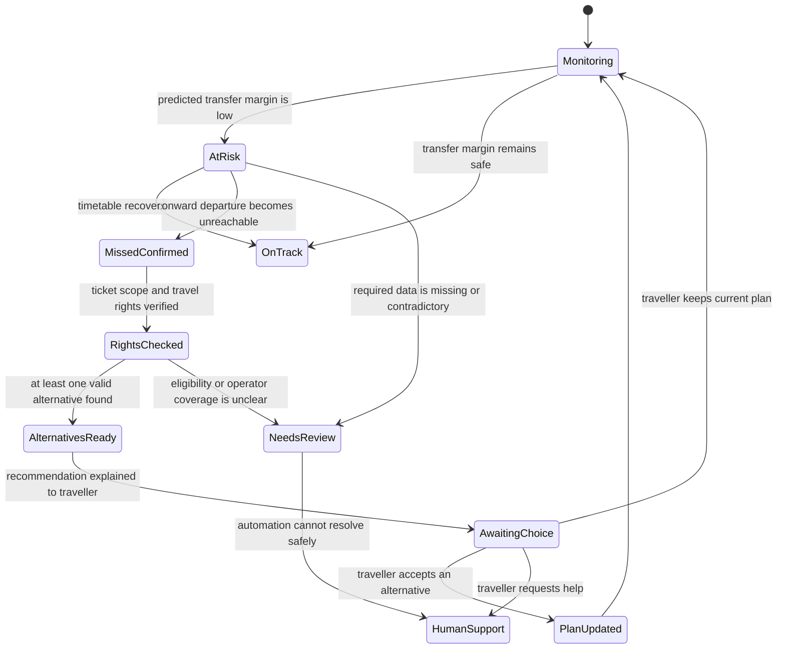

# Step 1: Missed-connection decision model

Status: Draft for product review  
Scope: Define the customer outcome and decision boundaries. No live API, LLM, autonomous action, or booking change is implemented in this step.

## Product outcome

When a booked connection becomes endangered, roamwell should help the traveller answer three questions:

1. Can I still make my connection?
2. If not, which train can I take with this ticket?
3. What do I need to do now?

The successful outcome is not “the agent produced an answer.” It is:

> The traveller reaches a valid next step with an accurate explanation, minimal effort, and no unsupported booking action.

For the prototype journey, the intended resolved state is:

> ICE 1573 is expected to arrive too late for the booked connection at München Hbf. The connection is treated as missed. Alex may continue on a suitable, non-reservation-required DB service using the original through-ticket. Roamwell recommends the best verified alternative and asks Alex to confirm before changing the journey plan shown in roamwell.

## Why this requires a state machine

A delay alone does not prove that a connection will be missed. The decision also depends on the predicted arrival time, the onward train's current departure time, the station transfer requirement, and the minimum transfer time. Ticket validity then depends on ticket scope, fare conditions, operators, and whether a train requires a reservation.

Keeping these stages separate prevents the product from making a confident recommendation from incomplete evidence.

## Customer-state model

## State definitions and customer treatment

| State | What must be true | What the customer sees | Allowed product behaviour |
|---|---|---|---|
| `Monitoring` | Journey and current timetable are available | Normal journey card | Observe only |
| `AtRisk` | Predicted transfer margin is below the agreed safety threshold, but the connection is not yet certainly missed | “Your connection may be at risk” with the current evidence | Explain and monitor; do not claim rebooking |
| `MissedConfirmed` | The onward service is no longer reachable using verified timetable and transfer data | “Your connection no longer works” | Begin rights and alternative checks |
| `RightsChecked` | Ticket scope, fare, operators, train binding and reservation constraints have been evaluated | Usually an internal transition | Record the applicable rule and its source |
| `AlternativesReady` | One or more live alternatives pass schedule, ticket and reservation checks | Ranked options with arrival time and trade-offs | Recommend; do not silently commit |
| `AwaitingChoice` | The traveller has enough information to decide | A clear confirmation action | Wait for customer choice |
| `PlanUpdated` | The traveller accepted an alternative | Updated journey plan plus unchanged-ticket explanation | Update roamwell's plan and monitoring target |
| `NeedsReview` | Evidence is missing, stale, contradictory, or outside supported policy | Honest uncertainty message | Stop automation and prepare handoff |
| `HumanSupport` | A person must resolve the case | Handoff status and retained context | Share evidence and open questions with support |

## Decision inputs

The decision must use explicit, inspectable inputs:

- Original itinerary and booking identifier
- Whether all legs are on one through-ticket or separate tickets
- Fare and train-binding status
- Operators for each leg
- Planned and current arrival/departure times
- Station and platform transfer information
- Minimum transfer time and any accessibility needs
- Reservation requirement for each proposed alternative
- Timestamp and freshness of every live-data result
- Applicable policy source, retrieval date, and rule version

Unknown values remain `unknown`; they must not silently become false, zero, or “eligible.”

## Decision rules for the first prototype case

1. Calculate the predicted transfer margin:

   `onward current departure - inbound predicted arrival - required transfer time`

2. Treat the connection as `AtRisk` when the margin is positive but below the product safety buffer.
3. Treat it as `MissedConfirmed` when the margin is negative or the onward train has departed.
4. Verify that the missed connection is part of the same ticket before making a through-journey rights claim.
5. For a qualifying DB journey, record that train binding is lifted when the connection is missed due to DB responsibility or when the applicable destination-delay threshold is met.
6. Exclude alternatives that require an unsupported operator, mandatory reservation, impossible transfer, or an unverified extra payment.
7. Rank valid alternatives by arrival time, transfer feasibility, number of additional changes, accessibility fit, and information freshness.
8. Ask the traveller before replacing the journey plan displayed in roamwell.
9. Escalate when ticket scope, cause, operator coverage, reservation requirements, or live data cannot be verified.

## Customer outcome for the prototype example

### Automation and customer-control boundary

Roamwell may perform these actions without asking because they are reversible analysis:

- Monitor live journey information
- Detect that a connection is at risk or missed
- Check ticket rules and retrieve supporting evidence
- Search, filter, and rank alternative journeys
- Prepare a recommendation

Roamwell must wait for the traveller before it:

- Replaces the journey plan the customer has chosen to follow
- Stops monitoring the original plan
- Makes a reservation, purchase, cancellation, or refund request
- Shares the customer's information with support or a carrier

The interface must describe an unaccepted option as **suggested**, never **updated**, **protected**, **reserved**, or **rebooked**. This is both a customer-trust rule and a testable product requirement.

### Trigger

- Inbound ICE 1573 is delayed.
- Predicted arrival at München Hbf: 13:47.
- Booked onward departure: before the passenger can complete the transfer.
- Both legs are assumed to be on one through-ticket for this prototype case.

### Customer message

**Your connection in Munich no longer works**

Your incoming train is expected to arrive after the transfer is possible. Your original ticket can be used on the verified alternative below.

### Recommended option

- Next suitable service: 14:11 from München Hbf
- New expected arrival: 16:26 at Salzburg Hbf
- Ticket action: no new ticket required for this prototype case
- Price now: €0 additional charge for this prototype case
- Original fare: unchanged; the existing ticket continues to cover the journey
- Compensation: assessed separately from ticket validity after the final arrival delay is known
- Customer action: review and accept the updated journey plan

### What happens to the ticket price

For this prototype case, both legs are on one DB through-ticket and the alternative is a covered, non-reservation-required service. Alex does not buy the journey again and roamwell does not change the original ticket price.

The customer-facing experience must distinguish three different money questions:

1. **Do I need to pay for the alternative?** No additional payment is expected for the verified alternative in this prototype case.
2. **Is my original ticket refunded?** No. Alex is continuing the journey using the original ticket, so the ticket is not refunded merely because another covered train is used.
3. **Could I receive compensation?** Possibly. Compensation is a separate passenger-rights outcome based on the final delay at the ticketed destination. It must not be promised before the qualifying delay is established.

The interface should show these answers beside the recommended alternative rather than hide them in fare conditions:

> **Ticket and price**  
> Your original ticket is valid on this alternative.  
> **Additional cost: €0**  
> We will check compensation after you arrive.

This statement is valid only after the ticket, operator, route, and reservation checks have passed. If an alternative requires the traveller to buy another ticket first, roamwell must show the upfront amount and reimbursement conditions before recommending it.

### Boundary language

Roamwell must not say “we rebooked you” unless a carrier booking operation actually occurred. For this case, the correct language is “we found a valid alternative” and “your original ticket remains valid.” Accepting the recommendation updates the journey displayed and monitored by roamwell.

## Ground-truth sources for this decision

- Deutsche Bahn, “In welchen Fällen ist die Zugbindung aufgehoben und was bedeutet das?”: https://www.bahn.de/faq/zugbindung-aufgehoben-bedeutung
- Deutsche Bahn, “Ich habe meinen Anschlusszug aufgrund einer Zugverspätung verpasst. Kann ich einen anderen Zug nutzen?”: https://www.bahn.de/faq/ich-habe-meinen-anschlusszug-aufgrund-einer-zugverspaetung-verpasst-kann-ich-einen-anderen-zug-nutzen
- Deutsche Bahn, “Ihre Rechte als Fahrgast im Eisenbahnverkehr”: https://www.bahn.de/service/informationen-buchung/fahrgastrechte/rechtliche-regelungen

These pages are the current product-policy references for this draft. In a production design, policy content would be versioned, dated, monitored for change, and reviewed by a qualified policy or legal owner.

## Acceptance criteria for Step 1

Step 1 is ready to approve when:

- At-risk and confirmed-missed states are not conflated.
- The same-ticket assumption is explicit.
- Live facts, policy conclusions, and recommendations are distinguishable.
- The traveller can see whether an alternative costs more, whether the original ticket is refunded, and whether compensation is only a later possibility.
- The product never claims a carrier rebooking when it only updates roamwell's journey plan.
- Customer confirmation is required before the displayed plan changes.
- Missing or conflicting evidence has a defined escalation state.
- The intended customer message and recommended outcome are understandable without reading the internal workflow.

## Decisions intentionally left for later steps

- Exact DB API endpoints and data contracts
- The safety-buffer value for an at-risk connection
- Retrieval architecture and policy-document ingestion
- Prompt design and model selection
- Alternative-ranking weights
- Human-support operating model
- Golden dataset, automated evaluations, launch thresholds, latency, and cost budgets
